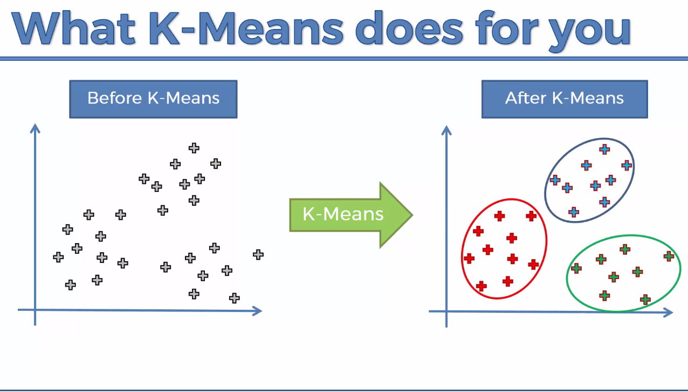

## Introduction

You can explore all my work pertaining to Clustering segment using K-Means specifically.

## Dependencies to execute the notebook:
1. Python 3.6.x
2. pip installation manager
3. Jupyter Notebook
4. Numpy
5. Pandas
6. Matplotlib
7. Seaborn

## What is K-Means Clustering ?
It is basically a type of unsupervised learning method . An unsupervised learning method is a method in which we draw references from datasets consisting of input data without labeled responses. Generally, it is used as a process to find meaningful structure, explanatory underlying processes, generative features, and groupings inherent in a set of examples.

Clustering is the task of dividing the population or data points into a number of groups such that data points in the same groups are more similar to other data points in the same group and dissimilar to the data points in other groups. It is basically a collection of objects on the basis of similarity and dissimilarity between them.

## References

1. https://towardsdatascience.com/understanding-k-means-clustering-in-machine-learning-6a6e67336aa1
2. https://towardsdatascience.com/how-does-k-means-clustering-in-machine-learning-work-fdaaaf5acfa0
3. https://www.datascience.com/blog/k-means-clustering
4. https://www.geeksforgeeks.org/k-means-clustering-introduction/
5. https://www.geeksforgeeks.org/clustering-in-machine-learning/
